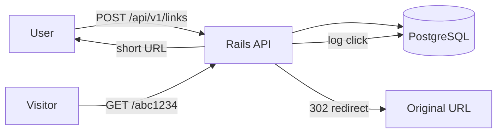

# Link Shortener API

A URL shortener microservice built with Rails 8.1. Give it a long URL, get back a short one. When someone opens the short link, they get redirected to the original and the visit is logged with timestamp and country.

## How It Works



Short codes are 7-character random strings from `[0-9a-zA-Z]` (base62). That gives roughly 3.5 trillion combinations, so collisions are astronomically unlikely. Each visit is stored as an individual event rather than a counter, which lets you slice analytics by date, country, or whatever else you need later.

## Prerequisites

- Ruby 3.4
- PostgreSQL 14+
- Bundler (`gem install bundler`)

## Getting Started

```bash
git clone <repo-url>
cd link-shortener-api
bundle install
bin/rails db:create db:migrate
bin/rails server
```

The API runs on `http://localhost:3000` by default.

## Running Tests

```bash
bundle exec rspec
```

Linting:

```bash
bundle exec rubocop
```

Security scans:

```bash
bin/brakeman --no-pager
bin/bundler-audit
```

## API Endpoints

### Create a short link

```
POST /api/v1/links
Content-Type: application/json

{ "link": { "target_url": "https://example.com/some/long/path" } }
```

Response (201):

```json
{
  "short_code": "Xk9mR2q",
  "short_url": "http://localhost:3000/Xk9mR2q",
  "target_url": "https://example.com/some/long/path",
  "title": "Example Page Title"
}
```

### Follow a short link

```
GET /:short_code
```

Returns a 302 redirect to the target URL. Only GET requests record a click (with timestamp, country via IP geolocation, and user agent). HEAD requests redirect without tracking -- useful for link previews and health checks.

### View link stats

```
GET /api/v1/links/:short_code/stats
```

Response (200):

```json
{
  "short_code": "Xk9mR2q",
  "title": "Example Page Title",
  "total_clicks": 42,
  "clicks_by_country": { "SG": 25, "US": 10, "UNKNOWN": 7 },
  "clicks_by_date": { "2026-02-17": 20, "2026-02-18": 22 }
}
```

Country codes come from IP geolocation. Clicks from private/loopback IPs or failed lookups show as `"UNKNOWN"`.

## Project Structure

```
app/
  controllers/
    api/v1/links_controller.rb   # create links, view stats
    redirects_controller.rb      # handle short URL redirects
  models/
    link.rb                      # short_code + target_url + title
    click_event.rb               # one row per visit
  services/
    clicks/recorder_service.rb   # logs a visit with geo + hashed IP
    links/short_code_generator.rb # random base62 codes
    links/title_fetcher.rb       # grabs <title> from target URL
```

## Key Dependencies

| Gem | Purpose |
|-----|---------|
| rails 8.1 | Web framework (API mode) |
| pg | PostgreSQL adapter |
| puma | App server |
| faraday | HTTP client for title fetching |
| geocoder | IP-to-country lookup |
| rack-cors | Cross-origin request handling |
| rack-attack | Rate limiting |
| rspec-rails | Test framework |
| rubocop | Linter (Rails omakase style) |
| brakeman | Static security analysis |
| webmock | HTTP stubbing in tests |
| factory_bot_rails | Test data factories |

## Design Decisions

**Random base62 codes** -- 7 characters from `[0-9a-zA-Z]` gives 62^7 ~ 3.5 trillion unique codes. Generation retries on collision (up to 3 attempts), though the probability of even one collision at realistic scale is negligible. An alternative would be encoding the database ID, but that leaks how many links have been created.

**Event-based click tracking** -- Each visit creates a `click_event` row instead of incrementing a counter. More storage, but you can query by date range, country, or any combination without schema changes.

**IP hashing** -- Visitor IPs are stored as SHA-256 hashes, not plaintext. Good enough to detect repeat visitors without storing personally identifiable data.

**Title fetching with timeout** -- The target page's `<title>` tag is fetched synchronously during link creation with a 3-second connect / 5-second read timeout. Falls back to `og:title` meta tag when `<title>` is absent. Sends a browser-like User-Agent and only parses HTML responses. If the fetch fails for any reason, the link is still created with a nil title.

## Deployed URL

_TODO: add deployment URL once deployed_
